# ElevenTales

[](https://elevenlabs.io) [](https://elevenlabs.io/voice-design) [](https://elevenlabs.io/voice-cloning) [](https://www.python.org) [](https://react.dev)

> **Note:** This app was hosted on Replit's free tier and has been taken down. To try it, [run it locally](#running-locally).

**ElevenTales turns a child's words into a living, breathing story.**

A voice-first interactive storytelling app for kids, powered by **ElevenLabs Conversational AI**, **Voice Design**, **Voice Cloning**, and **Nano Banana 2** 🍌.

Children simply pick a storyteller, then pick a theme — hold up a toy or draw an idea — and begin a **real-time conversation** where the AI and child co-create a story together. The storyteller speaks, listens, adapts to interruptions, and generates illustrations as the adventure unfolds.

Every voice is distinct. **Design a storyteller** from scratch, shaping a voice that has never existed before. **Clone a voice** and become the narrator. The story is always theirs. **ElevenLabs makes it real.**

<p align="center">
  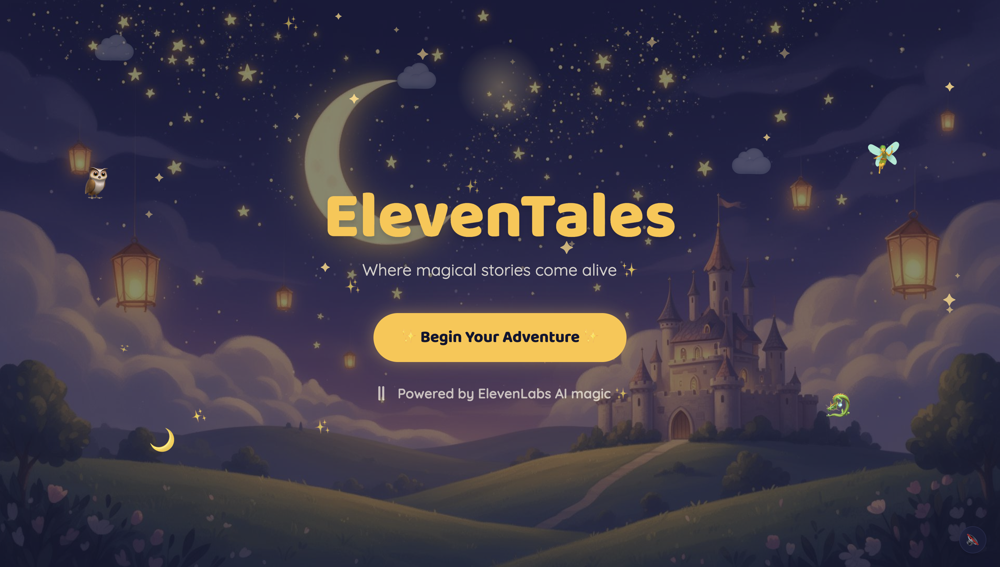
</p>

## Contents

- [Meet ElevenTales](#meet-eleventales)
  - [The Storytellers](#the-storytellers)
  - [The Experience](#the-experience)
    - [Pick a Theme](#1-pick-a-theme)
    - [Magic Camera](#2-magic-camera)
    - [Sketch a Theme](#3-sketch-a-theme)
  - [A Living, Illustrated Story](#a-living-illustrated-story)
  - [Creativity Rewards](#creativity-rewards)
  - [Story Recap & PDF Download](#story-recap--pdf-download)
  - [Voice Design — Build a Storyteller](#voice-design--build-a-storyteller)
  - [Voice Cloning — Become the Storyteller](#voice-cloning--become-the-storyteller)
- [ElevenLabs — The Engine of Everything](#elevenlabs--the-engine-of-everything)
- [Key Features](#key-features)
- [Architecture](#architecture)
- [Built With](#built-with)
- [Try It Out](#try-it-out)
- [Running Locally](#running-locally)

---

# Meet ElevenTales

## The Storytellers

ElevenTales is powered by **ElevenLabs Conversational AI** — every character has a real voice, designed specifically for them via the Voice Design API. Not generic TTS. Not a chatbot. A living storyteller who listens, responds, and improvises.

**5 built-in storytellers. Unlimited custom ones.**

| Character | Language | Personality |
|---|---|---|
| Wizard Wally | English | Wise, mysterious, full of riddles |
| Fairy Flora | English | Joyful, whimsical, bursting with wonder |
| Captain Coco | English | Swashbuckling, adventurous, loves treasure |
| Dadi Maa | Hindi | Warm, grandmotherly, rooted in Indian folklore |
| Raja Vikram | Tamil | Ancient, mythic, storytelling from a royal court |

Children can also **design their own character** — describe a voice, hear three generated previews, and instantly create a new storyteller. Or **clone their own voice** and become the narrator.

<p align="center">
  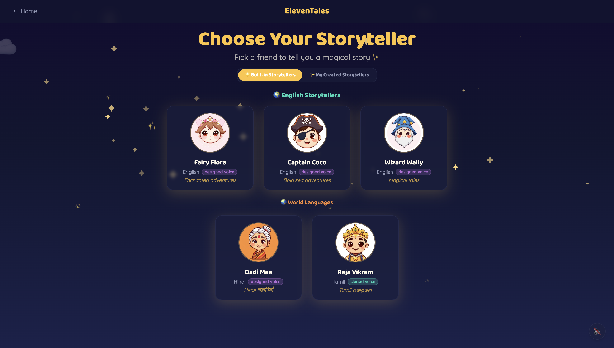
</p>

---

## The Experience

Children start a story in **three magical ways**:

<p align="center">
  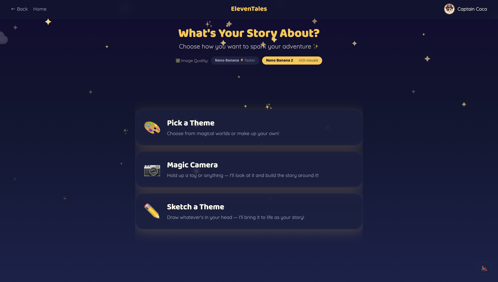
</p>

---

### 1. Pick a Theme

Choose from adventure themes or life-skills topics — or type **anything their imagination invents**.

<p align="center">
  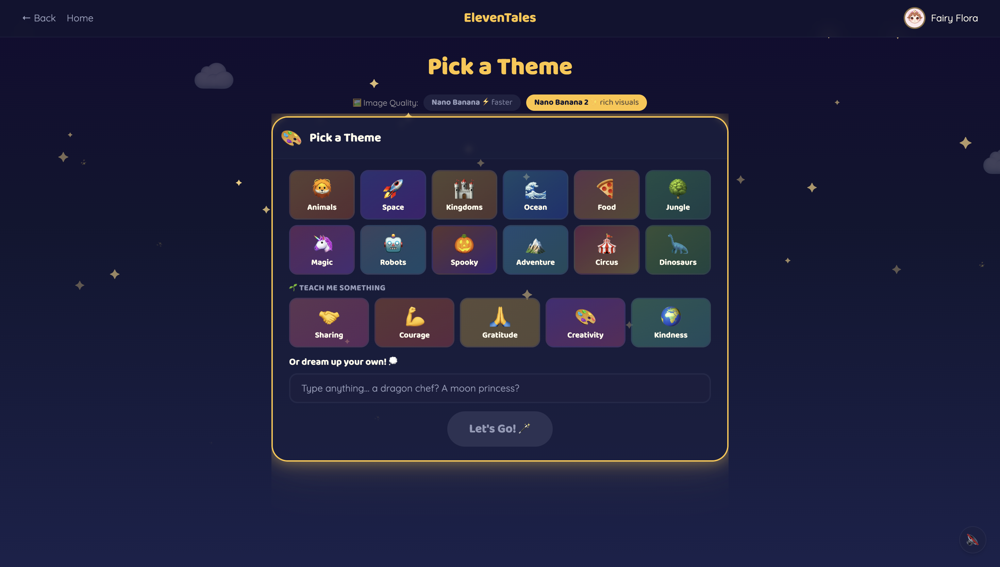
</p>

If a custom theme isn't appropriate for children, a friendly message blocks it before the story starts. Safety filters are applied to all story entry points.

---

### 2. Magic Camera

Hold up **any toy or object**.

The AI will:

1. Recognise the object
2. Transform it into a **storybook character**
3. Turn it into the **hero of the story**

Examples:

```
Stuffed penguin   → A fluffy penguin pal on a frozen quest
LEGO rocket       → Galactic rescue pilot saving the stars
```

If the object shown is inappropriate, the safety filter blocks it before the story starts.

<p align="center">
  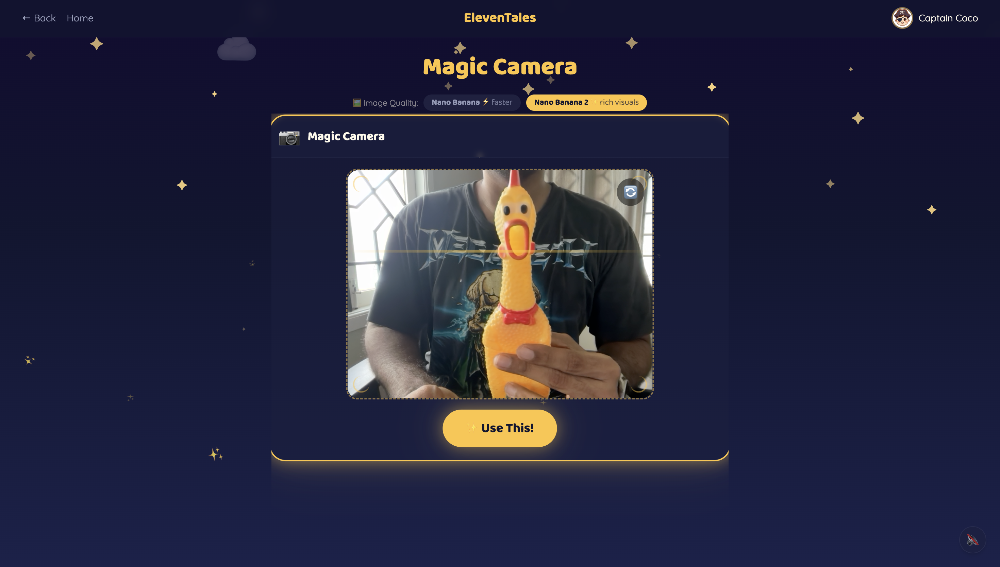
  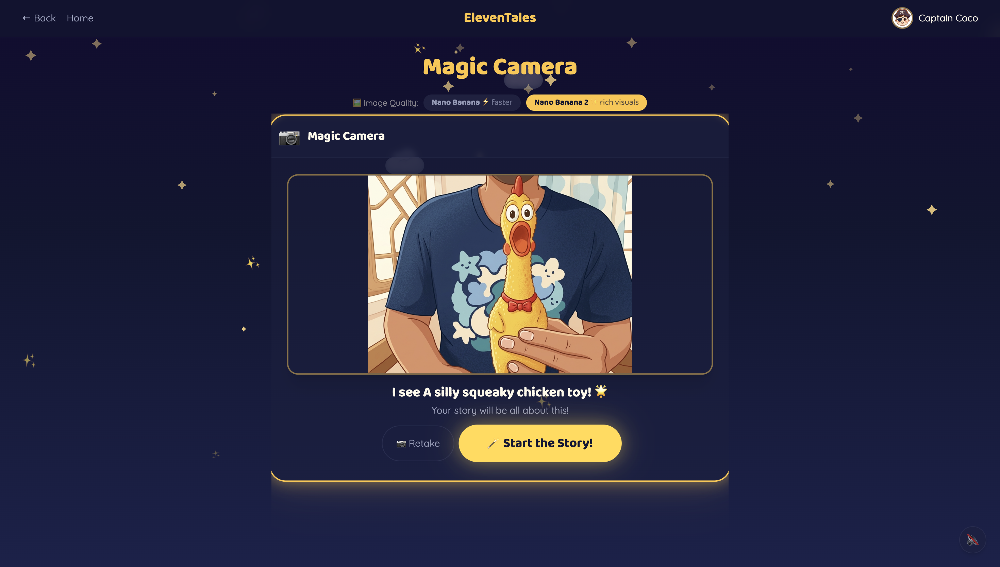
</p>

---

### 3. Sketch a Theme

Kids can **draw anything** on a canvas.

The AI turns the drawing into a **storybook illustration** and starts a story around it.

Draw mountains, a castle, a robot, a dragon, a flying whale — and watch it come to life.

<p align="center">
  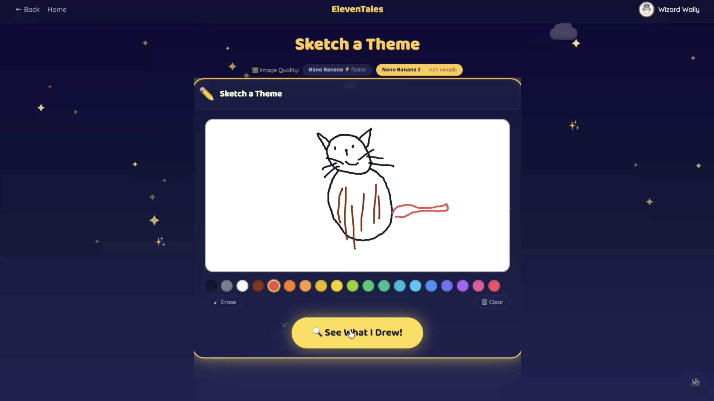
  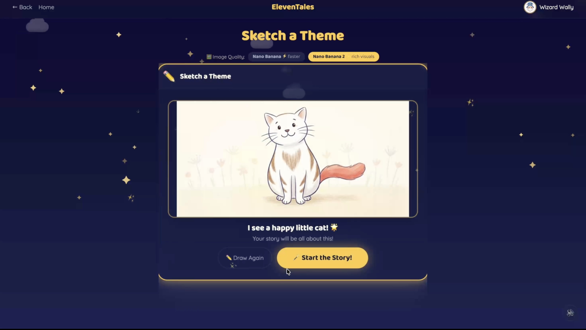
</p>

---

## A Living, Illustrated Story

Unlike traditional story generators, ElevenTales is **fully conversational**. Children can interrupt the storyteller, change the story direction, add characters, and invent new twists at any moment.

```
AI:    The dragon and the little knight stood at the edge of the volcano...

Child: Make the dragon sneeze and blow them into the sky!

AI:    And with one enormous sneeze, the dragon launched them both
       into the clouds — and the knight discovered she could fly.
```

Barge-in is native — ElevenLabs detects when the child starts speaking, stops the current narration, and weaves their words into the next story beat.

As the story unfolds, **illustrations appear automatically**. The agent decides the right visual moment — a new location, character reveal, or dramatic transformation — and generates an image from its own scene description, so it always matches what was just narrated. Each new image is painted by **Nano Banana** 🍌 and receives the **previous image as context**, keeping characters and art style consistent across every scene.

<p align="center">
  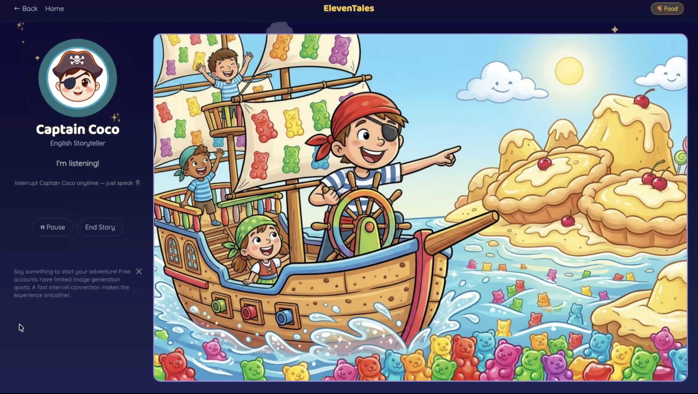
</p>

---

## Creativity Rewards

ElevenTales recognises and celebrates when a child contributes something genuinely imaginative.

When a child names a character, invents a wild idea, or takes the story in an unexpected direction, **the agent awards them a creativity badge** on the spot.

The badge appears in the centre of the screen and auto-dismisses after a few seconds — a small moment of delight that tells the child their imagination matters.

Badges are saved with the story and shown in the **Story Recap** and **Past Adventures gallery**.

<p align="center">
  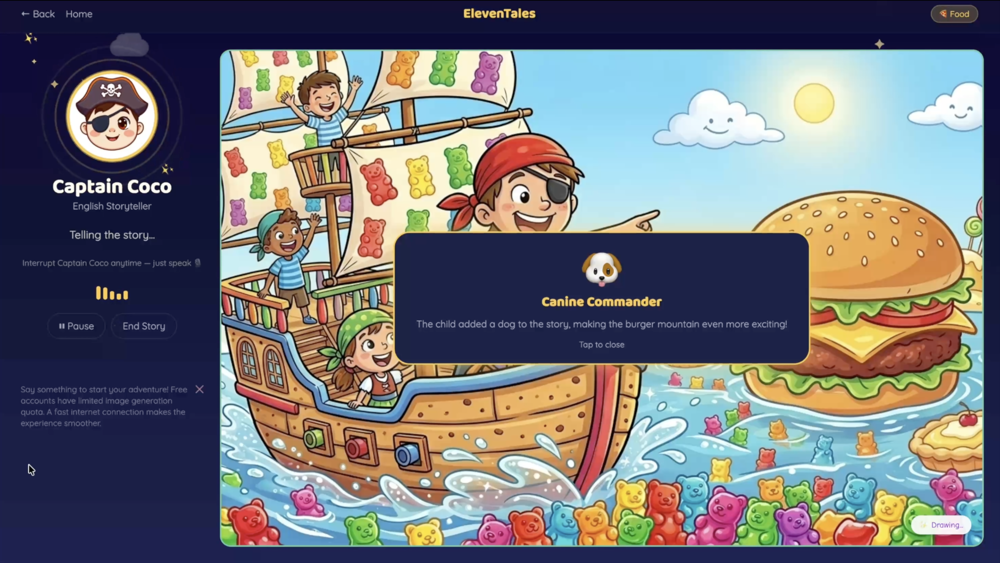
</p>

---

## Voice Design — Build a Storyteller

<p align="center">
  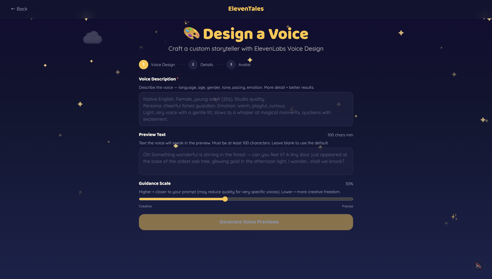
</p>

1. Go to **My Created Storytellers** → **Design a Voice**
2. Describe the character — name, personality, voice style, language
3. Listen to **3 generated voice previews** from the ElevenLabs Voice Design API
4. Pick your favourite — a full ElevenLabs Conversational AI agent is created instantly
5. The character is immediately ready to tell stories

---

## Voice Cloning — Become the Storyteller

<p align="center">
  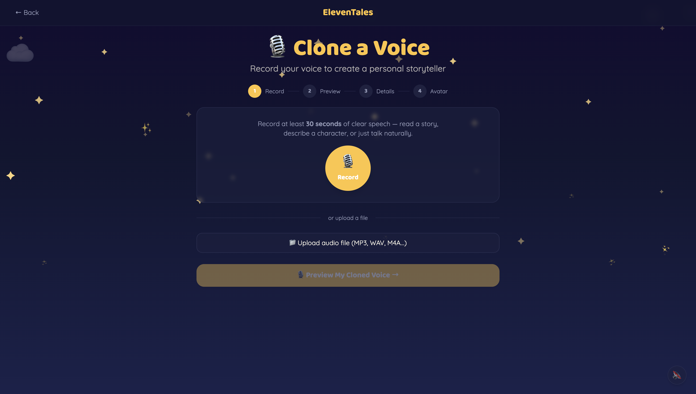
</p>

1. Go to **My Created Storytellers** → **Clone a Voice**
2. Record a short voice sample (or upload audio)
3. ElevenLabs **Scribe v2** automatically detects the spoken language — the preview plays back in that language
4. Give the character a name and personality
5. Your cloned voice becomes a full ElevenLabs Conversational AI agent — **you narrate your own story**

Preview voices are automatically deleted if you re-record or navigate away — only the final voice kept when a character is created counts against your quota.

---

# ElevenLabs — The Engine of Everything

ElevenLabs is not a feature in ElevenTales. It is the foundation.

| Feature | How We Use It |
|---------|--------------|
| **Conversational AI Agents** | Every built-in storyteller is a live ElevenLabs agent — real-time voice conversation, barge-in, tool calling, dynamic branching. The story is never scripted; the agent improvises around what the child says. |
| **Voice Design API** | Parents and children describe a character — "a gentle old wizard with a deep voice" — and the Voice Design API generates three distinct voice previews. The selected voice becomes a permanent storyteller. |
| **Instant Voice Cloning (IVC)** | A child records their own voice and clones it. Their voice, their storyteller, their story — narrated by themselves. Preview voices are automatically cleaned up if the session is abandoned, so only one voice per character is ever saved. |
| **Signed URLs** | Agent sessions are authenticated server-side. The ElevenLabs API key never reaches the browser. The frontend calls `/api/session`, which returns a short-lived signed WebSocket URL. |
| **Dynamic Variables** | `{{theme}}` is injected at session start — the child's chosen theme, camera prop label, or sketch description. The agent receives this before speaking its first word and builds the entire story around it. |
| **Client Tools** | The agent calls `generate_illustration` at the exact dramatic moment it chooses to trigger a Gemini scene illustration. It calls `award_badge` silently when a child earns one. Both tools fire in the browser — no round-trip to the backend. |
| **Sound Effects Generation** | Scene reveal sound effects are generated live via the ElevenLabs Sound Effects API — a soft magical chime as each illustration appears. |
| **Expressive Voice Model** | All agents use `eleven_v3_conversational` with **expressive mode** enabled — voices convey genuine emotion, not flat narration. Excitement, suspense, warmth, and wonder come through naturally as the story unfolds. |
| **Multilingual TTS** | Built-in characters speak in English, Hindi, and Tamil via `eleven_v3_conversational`. The storyteller's language is the child's language. |
| **Speech-to-Text (Scribe v2)** | Used during voice cloning — detects the language the user spoke, auto-selects the correct preview text and TTS model, and surfaces a "Detected Language" badge in the UI. |
| **`@11labs/client` SDK** | The frontend connects directly to the ElevenLabs WebSocket using the official SDK — real-time audio, barge-in, and tool call dispatch, all handled natively. |

---

# Key Features

- **Live voice conversations** — children talk, the storyteller listens and responds in real time; no typing ever
- **Barge-in support** — children can interrupt and redirect the story at any point mid-sentence
- **5 built-in storytellers** — English, Hindi, and Tamil characters with distinct AI-designed voices, all using `eleven_v3_conversational` with **expressive mode**
- **Voice Design** — describe a character; hear 3 generated voice previews; create a custom storyteller instantly
- **Voice Cloning** — clone your own voice and become the narrator of your own story
- **Magic Camera** — point at any toy or object; the story builds itself around it with a storybook illustration
- **Sketch Mode** — draw anything; it becomes the story's centrepiece, illustrated in storybook style
- **Dynamic scene illustrations** — **Nano Banana** 🍌 generates storybook art as the story unfolds, each scene visually continuous with the last
- **Dual illustration trigger** — agent calls `generate_illustration` at dramatic moments; a frontend fallback fires if the agent pauses
- **Creativity badges** — silently awarded for genuine creative contribution (naming a character, inventing a twist — not just saying "yes")
- **Story recap** — full illustrated storybook with a generated title at the end of every session; download as a **PDF** to keep forever
- **2-minute preview mode** — free users get a full 2-minute story experience; a graceful end screen offers the recap or a fresh start
- **Past Adventures** — gallery of every previous story with its illustrations
- **Child-safe content moderation** — themes, camera subjects, and sketches screened before the story begins
- **Sound effects** — ElevenLabs-generated audio chimes on every scene reveal
- **Ambient sound** — background music on the landing screen, silenced during story and voice cloning

---

# Architecture

```
Browser (@11labs/client + React)
  ├── GET  /api/session?character_id=   → Backend issues signed ElevenLabs URL
  ├── WebSocket → signed_url            → ElevenLabs Conv AI agent (direct, no proxy)
  ├── Client tool: generate_illustration → POST /api/image → Gemini illustration
  ├── Client tool: award_badge          → badge displayed in browser
  └── GET  /api/sfx                     → ElevenLabs Sound Effects proxy

Backend (FastAPI)
  ├── /api/session                      → ElevenLabs signed URL
  ├── /api/image                        → Gemini scene illustration
  ├── /api/sketch-preview               → Gemini sketch → storybook art + label
  ├── /api/check-theme                  → content moderation
  ├── /api/story-recap                  → Gemini title + per-scene narration
  ├── /api/sfx                          → ElevenLabs sound effects
  ├── /api/characters/custom            → list custom characters
  ├── /api/characters/design-previews   → Voice Design previews
  ├── /api/characters/save              → save character + create agent
  ├── /api/character/avatar             → Gemini character portrait
  ├── /api/voice-clone/preview          → Scribe v2 language detect + IVC clone + TTS preview
  └── /api/voice-clone/create           → create agent from cloned voice
```

### The Agent

Each character is a full **ElevenLabs Conversational AI agent** configured with:

- **LLM:** Gemini 2.5 Flash (inside the ElevenLabs platform)
- **Dynamic variable:** `{{theme}}` — injected at session start before the first word
- **Two client tools** — `generate_illustration` and `award_badge` — called autonomously mid-narration
- **Auth:** Signed URL — the API key never leaves the backend

### Session Flow

The browser calls `/api/session` → receives a short-lived signed WebSocket URL → connects directly to ElevenLabs via `@11labs/client`. No audio proxy. The backend's only role during a story is serving image generation and sound effects.

### Illustration Pipeline

The agent decides the visual moment, writes its own scene description, and fires `generate_illustration`. The frontend sends the description + the previous image to `/api/image`, which calls **Nano Banana** 🍌 for a storybook illustration. Each image seeds the next — visual continuity is maintained without any external state.

---

# Built With

### AI & Voice
| Model / API | Role |
|---|---|
| **ElevenLabs Conversational AI** | **The Agent** — real-time voice conversation, barge-in, autonomous tool calls (`generate_illustration`, `award_badge`) |
| **ElevenLabs Voice Design API** | Generate 3 voice previews from a text description; create custom storyteller voices |
| **ElevenLabs Instant Voice Cloning (IVC)** | Clone a child's voice into a full storyteller agent |
| **ElevenLabs Speech-to-Text (Scribe v2)** | Auto-detects spoken language from the voice clone recording; selects preview text and TTS model accordingly |
| **ElevenLabs Sound Effects API** | Live-generated audio chimes on scene reveal |
| `eleven_v3_conversational` + expressive mode | TTS for all characters — conveys genuine emotion, warmth, and drama |
| `gemini-3.1-flash-image-preview` (**Nano Banana 2** 🍌) | Storybook scene illustration |
| `gemini-2.5-flash-lite` | Content moderation + story recap titles and narrations |
| `gemini-2.5-flash` | LLM inside each ElevenLabs agent |

### SDKs & Frameworks
| SDK / Framework | Usage |
|---|---|
| **`@11labs/client`** | Browser-side WebSocket connection to ElevenLabs — real-time audio, barge-in, tool call dispatch |
| **Google GenAI Python SDK** | Image generation, content moderation, story recap — all Gemini API calls on the backend |
| **FastAPI** | Python backend — session auth, image generation, voice design/cloning endpoints, SPA serving |
| **React 18 + Vite + TypeScript** | Frontend SPA |
| **TailwindCSS** | Styling |
| **Framer Motion** | Character and UI animations |
| **Web Audio API** | Microphone capture and audio playback in the browser |

### Infrastructure
| Service | Role |
|---|---|
| **Localhost** | `bash start.sh` builds the frontend and starts FastAPI at `http://localhost:8080` |
| **Replit** | Previously hosted on Replit free tier — deployment is now down; run locally instead |

---

# Try It Out

> **The hosted Replit deployment has been taken down** (it was running on a free-tier account). To try ElevenTales, run it locally — see [Running Locally](#running-locally) below.

1. Start the app locally with `bash start.sh` and open [http://localhost:8080](http://localhost:8080) on a device with a microphone
2. Click **Begin Your Adventure** → pick a storyteller → choose a theme, use Magic Camera, or draw a Sketch
3. Allow microphone access — the story starts immediately
4. Speak to redirect the story, interrupt mid-sentence, or suggest ideas

---

# Running Locally

**Prerequisites:** Python 3.12+, Node.js 18+, [uv](https://docs.astral.sh/uv/), an ElevenLabs API key, and a Gemini API key.

### 1. Clone and install

```bash
git clone https://github.com/padmanabhan-r/ElevenTales.git
cd ElevenTales
cd frontend && npm install
cd ../backend && uv sync
```

### 2. Configure environment

Create `backend/.env`:

```env
ELEVENLABS_API_KEY=your-elevenlabs-key
GEMINI_API_KEY=your-gemini-key
IMAGE_MODEL=gemini-3.1-flash-image-preview  # Nano Banana 2 (default) or gemini-2.5-flash-image for Nano Banana
```

### 3. Create built-in characters (one-time)

```bash
cd backend && uv run python setup_voices.py
```

Creates ElevenLabs Voice Design voices and Conversational AI agents for all 5 built-in characters. Writes `backend/character_ids.json` (gitignored).

To recreate a single character:

```bash
uv run python setup_voices.py --char fairy --force
```

### 4. Run

```bash
bash start.sh
```

Builds the frontend, starts FastAPI at `http://localhost:8080`.

| | URL |
|---|---|
| App | http://localhost:8080 |
| Backend | http://localhost:8080 |
| Health | http://localhost:8080/api/health |


